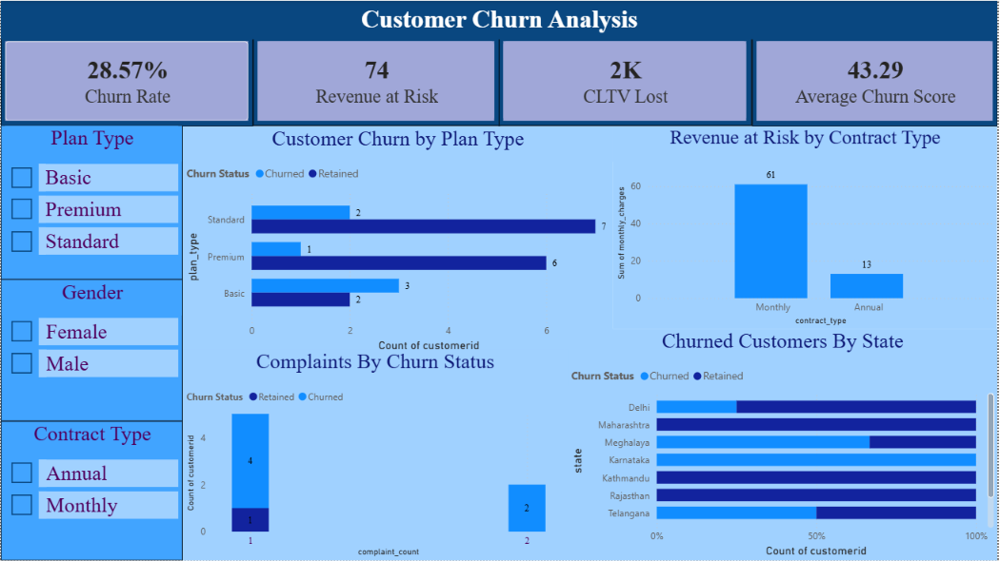
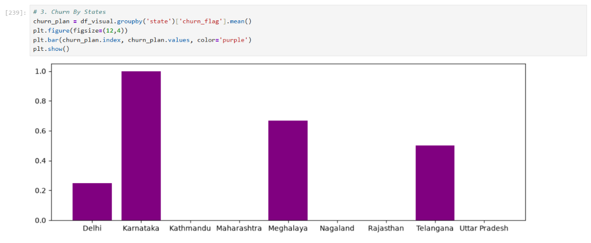
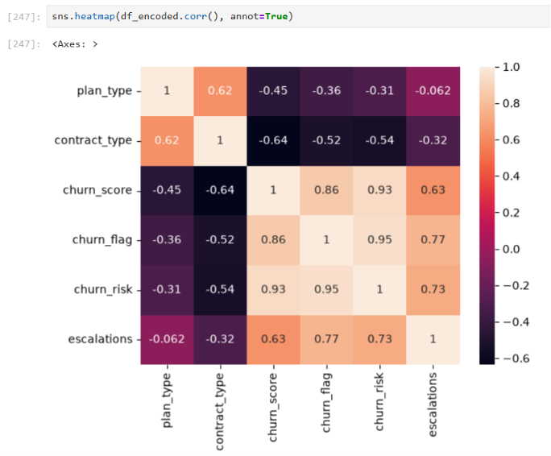

# 📊 Customer Churn Analysis using Python, SQL & Power BI
> An end-to-end Data Analytics project that uncovers customer churn patterns, revenue loss, and retention opportunities through SQL, Python, and Power BI.

# 📖 Project Overview
Customer churn is one of the biggest challenges faced by subscription-based businesses. Losing existing customers reduces recurring revenue and increases customer acquisition costs.
This project analyzes customer, subscription, and support data to identify the key drivers behind customer churn and revenue loss. The workflow covers SQL data extraction, Python-based data cleaning and exploratory analysis, KPI calculation, and an interactive Power BI dashboard.

# 🎯 Business Problem
The business wants to answer the following questions:
- 📉 What is the overall customer churn rate?
- 💰 How much revenue is at risk because of churn?
- 📊 Which subscription plans experience the highest churn?
- 📅 Which contract type contributes the most revenue loss?
- 🌍 Which states have the highest number of churned customers?
- 📞 Do customer complaints increase churn?
- 💎 How much Customer Lifetime Value (CLTV) has been lost?

# 📌 Executive Summary
The analysis revealed:
- 📉 **28.57% Customer Churn Rate**
- 💰 **74 Revenue at Risk**
- 💎 **2K CLTV Lost**
- 📈 **43.29 Average Churn Score**

Key findings include:
- 📌 Basic plan customers churn more frequently.
- 📌 Monthly contracts generate the highest revenue risk.
- 📌 Customers with complaints are more likely to churn.
- 📌 Some states contribute disproportionately to customer churn.
- 📌 Churn scores help identify high-risk customers for retention.

# 📷 Dashboard and Jupyter Notebook charts preview
## Power BI Dashboard

## Bar Chart Using Matplotlib

## HeatMap Using Seaborn


# 📊 Dashboard KPIs
| 📌 KPI | 📖 Description |
|---------|---------------|
| 📉 Churn Rate | Percentage of customers who cancelled subscriptions |
| 💰 Revenue at Risk | Monthly recurring revenue lost due to churn |
| 💎 CLTV Lost | Lifetime customer value lost because of churn |
| 📈 Average Churn Score | Average churn risk score |

# 📈 Dashboard Features
- 📊 Customer Churn by Plan Type
- 💰 Revenue at Risk by Contract Type
- 📞 Complaints by Churn Status
- 🌍 Churned Customers by State
- 🎛 Interactive Slicers
  - Plan Type
  - Gender
  - Contract Type

# 🛠 Tools & Technologies
| Tool | Purpose |
|------|---------|
| 🐍 Python | Data Cleaning & EDA |
| 🗄 SQLite | Database |
| 🐼 Pandas | Data Manipulation |
| 🔢 NumPy | Numerical Analysis |
| 📊 Matplotlib | Visualization |
| 🎨 Seaborn | Statistical Charts |
| 📈 Power BI | Dashboard Development |
| 📒 Jupyter Notebook | Analysis |

# ⚙ Project Workflow
```
SQLite Database
       │
       ▼
🐍 Python
(Data Cleaning)
       │
       ▼
📊 Exploratory Data Analysis
       │
       ▼
📈 KPI Calculation
       │
       ▼
💾 Export Clean Dataset
       │
       ▼
📊 Power BI Dashboard
       │
       ▼
📋 Business Insights
```

# 📂 Dataset
The project integrates three business datasets:
- 👤 Customer Information
- 💳 Subscription Information
- 📞 Customer Support Information
All tables are merged using **Customer ID**.

# 💡 Business Value
This dashboard enables businesses to:
- 🎯 Identify high-risk customers
- 📉 Reduce customer churn
- 💰 Minimize revenue loss
- 🤝 Improve customer retention
- 📞 Prioritize customer support
- 📈 Increase customer lifetime value

# 📁 Repository Structure
```
Customer-Churn-Analysis/
│
├── 📒 Customer_Churn_Analysis.ipynb
├── 📊 Customer_Churn_Analysis.pbix
├── 🗄 customer_churn.db
├── 📄 exported_churn_analysis_data.csv
├── 🖼 Dashboard_ss.png
├── 📖 README.md
└── 📋 businessinsights.md
```

# 🚀 Future Improvements
- 🤖 Machine Learning Churn Prediction
- 📊 Predictive Analytics
- 🔄 Real-Time Dashboard Refresh
- 🎯 Customer Segmentation
- 💬 Automated Retention Recommendation System

# 👩‍💻 Author
**Sakshi Mukherjee**
💼 Aspiring Data/Business Analyst

**Skills**
🐍 Python • 🗄 SQL • 📊 Power BI • 📈 Excel • 📉 Data Visualization • 📒 Jupyter Notebook


## ⭐ If you found this project helpful, consider giving it a Star!
